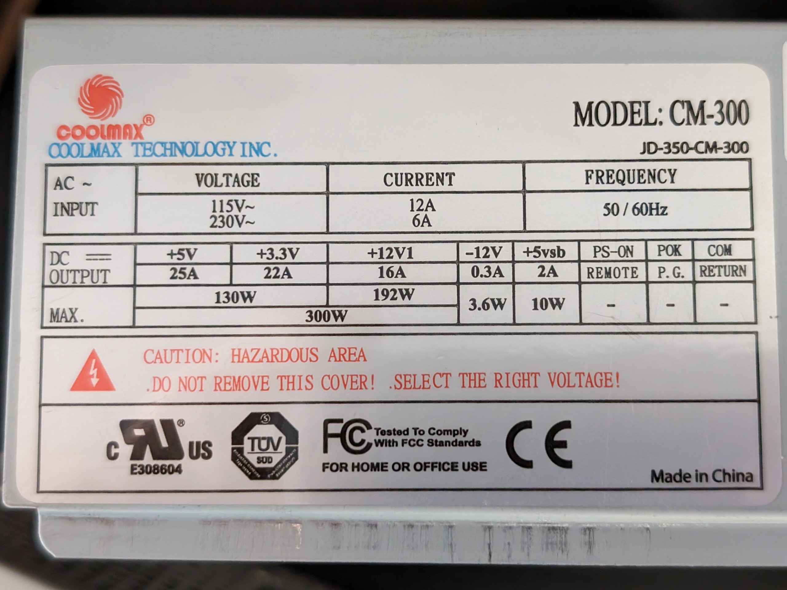
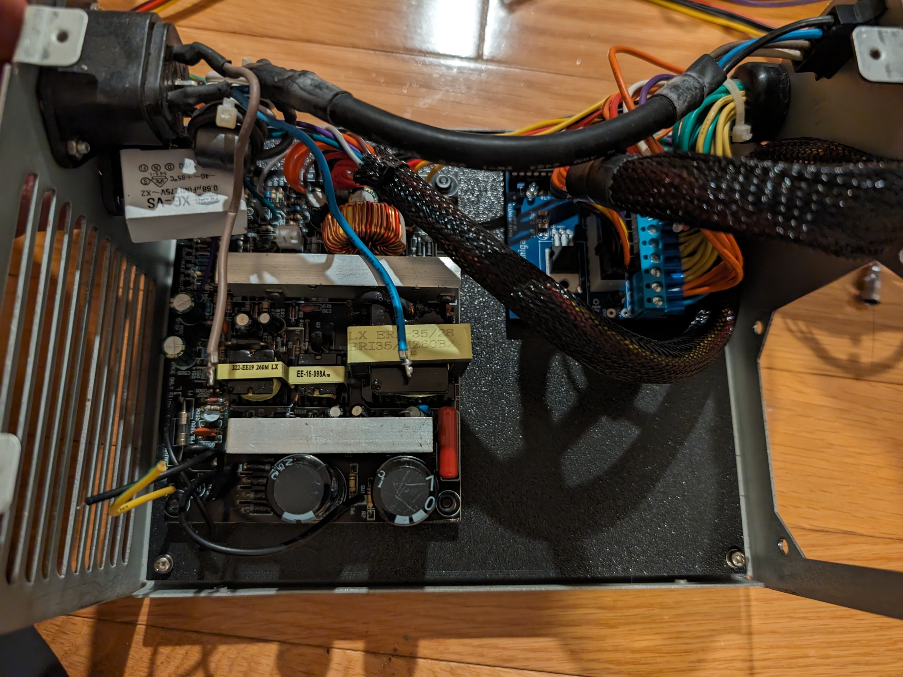
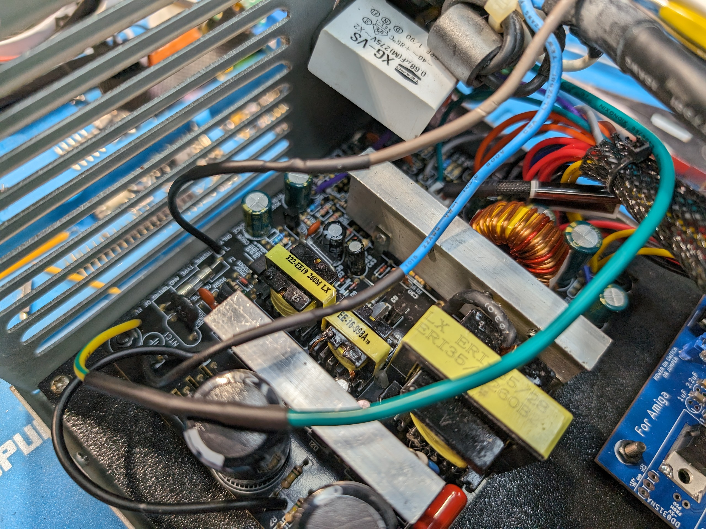

Here are some pictures of my little conversion of an Amiga 3000T PSU utilizing the original PSU enclosure and the insides of an SFX PSU attached to a 3D printed mounting plate.

In this project I've used a SFX form factor power supply Coolmax CM-300, because it had higher current on +5V rail. The mounting holes for the PSU's internal PCB were made for that particular PSU. You can adjust it in Tinkercad, it's pretty easy.

The blue board adding -5V and tick signal, I got from Szymon Gosk, not sure who makes them, but you can find them on eBay if you search for "Amiga 2000 / 3000 ATX Power Adapter with Tick and -5 volt"

With the power wires connected:

Good luck with your retro projects,
-Adam Polkosnik
